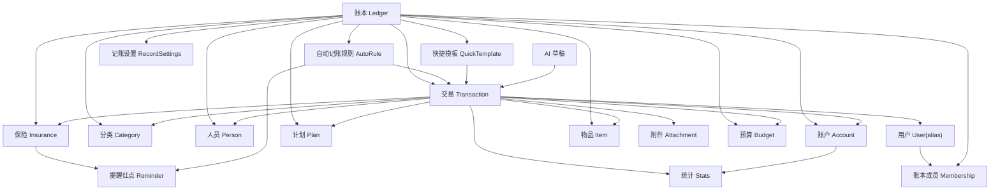

# Fin Nest 功能关系与边界

版本：v0.3  
依据：`claude-design/记账本.dc.html` 与 `ARCHITECTURE.md`  
目的：明确各功能模块之间的关联、所有权和边界，防止 agent 把业务逻辑写散、把模块职责混在一起。

## 1. 总体原则

- 账本是业务隔离边界。除用户身份外，交易、账户、分类、人员、计划、自动记账、快捷模板、保险、物品、附件都必须归属某个 `ledgerId`。
- 交易是财务事实中心。所有影响收支、账户余额、可收回、需归还、统计、计划的数据，都应通过交易或交易派生记录表达。
- 账户是余额事实中心。账户余额、子账户余额、可收回/需归还余额只能由账户服务或交易服务在事务中改变。
- 交易展示与统计使用有效金额。存在可收回/需归还关联时，有效金额 = 交易原始金额 - 关联金额合计。
- 统计、计划、筛选是读模型。它们可以缓存和聚合，但不能直接修改交易或账户。
- 自动记账、快捷记账、AI 都只能生成交易草稿或调用交易服务创建交易，不能绕过交易一致性规则。
- 保险和物品是关联资产档案，不是账户。它们可以被交易关联，但不直接改变收支事实。
- 前端只负责交互和展示。最终权限、财务规则、幂等、余额变更必须在 Nest.js API 完成。
- 前端视觉与组件边界见 `FRONTEND_DESIGN.md`；Liquid Glass 效果不能改变业务模块职责。

## 2. 核心关系图



## 3. 模块边界总表

| 模块 | 拥有的数据 | 可以调用 | 不允许做 |
|---|---|---|---|
| Auth/User | 用户、别名、登录凭证、会话 | Ledger 查询用户账本 | 不判断账本内业务权限，不保存账本业务数据 |
| ServiceToken | 外部系统 token、scope、吊销状态 | Integration API、审计 | 不等同于用户 session，不绕过用户/账本权限 |
| Ledger/Membership | 账本、成员、角色、邀请码、加入申请 | Auth/User、各业务模块做范围校验 | 不直接修改交易、账户余额 |
| RecordSettings | 记账表单字段顺序、显隐、账户/人员必填配置、金额小数位 | Transaction 表单初始化与校验 | 不影响历史交易结构，不改变交易事实 |
| Category | 收入/支出分类、二级分类、图标 | Transaction 校验引用 | 不删除导致历史交易无法展示 |
| Person | 账本内消费归属人员 | Transaction、Filter | 不等同于登录用户或账本成员 |
| Account | 账户、子账户、余额、资金变动 | Transaction、Stats | 不绕过交易服务创建收支流水 |
| Transaction | 支出、收入、转账、附件引用、关联对象 | Account、Category、Person、File、Insurance、Item | 不处理登录注册，不生成统计缓存 |
| Filter | 查询条件 DTO | Transaction/Stats 查询 | 不持久改变数据，不承载权限 |
| Stats | 聚合结果、缓存 | Transaction、Account | 不写交易，不写余额 |
| Plan | 命名计划、周期、命中规则 | Transaction 查询 | 不生成交易，不直接修改预算外数据 |
| Budget | 账本月度总预算、分类月度预算配置 | Transaction 查询 | 不生成交易，不写余额，不存历史周期 |
| AutoAccounting | 自动规则、下次生成、生成记录 | Transaction 服务 | 不直接插入交易表，不重复生成同周期交易 |
| QuickAccounting | 快捷模板 | Transaction 服务 | 不绕过交易校验，不保存财务事实 |
| Insurance | 保单档案、保费、保额、附件、状态 | Transaction 查询关联记录、File | 不作为账户，不直接产生支出 |
| Item | 物品档案、购买价、寿命、报废、附件 | Transaction 查询关联记录、File | 不作为账户，不直接产生折旧流水 |
| File | MinIO 对象、附件元数据 | 业务模块绑定附件 | 不决定业务权限，只执行授权后的文件操作 |
| AI | 识别任务、结构化输出、草稿 | Transaction/Insurance/Item 草稿接口 | 不自动落关键财务事实，必须经用户确认 |
| Reminder | 红点提醒计数聚合 | AutoRule、Plan、Insurance、LedgerJoinRequest | 不做站内提醒中心，不保存已读未读，不改变源业务状态 |
| Frontend | 移动端 UI、表单状态、缓存、Liquid Glass 组件 | API、共享 schema | 不写核心财务规则，不直接访问数据库/MinIO，不直接依赖第三方玻璃库 |

## 4. 用户、账本与成员

### 4.1 Auth/User 边界

Auth/User 只回答“这个人是谁”：

- 注册、登录、登出。
- 用户 id、邮箱、账号名、别名。
- 会话与 token。

Auth/User 不回答“这个人能不能改这笔账”。业务权限必须交给 Ledger/Membership 和具体业务模块共同判断。

用户字段边界：

- `email` 是邮箱和通知地址，可用于登录。
- `account` 是账号名，可用于登录，唯一。
- `alias` 是用户别名，用于界面展示、成员展示和审计展示，可修改。
- `alias` 不是 Person，也不是账本内消费归属对象。
- `isAdmin` 是系统管理员标记，只用于系统级管理，不等于账本 owner。

注册规则：

- 首次启动注册的第一个用户自动成为系统管理员。
- 系统管理员可以在设置中控制是否开放注册。
- 关闭开放注册后，普通用户不能自行注册。
- 账本 owner 是账本内角色，系统管理员是全局角色，两者不要混用。

登录态边界：

- 用户登录使用 opaque session token。
- session token 明文只给客户端，数据库只存 hash。
- session 可按设备、按用户、按禁用状态立即失效。
- 不使用纯 JWT 作为主登录态。

### 4.2 Ledger/Membership 边界

Ledger 是所有业务数据的上级容器：

- 账本有 owner。
- 账本有成员列表。
- 成员有角色，至少包括 owner/member。
- 邀请码或分享码属于账本。
- 邀请码默认有效期为 1 天。
- 用户通过邀请码只创建加入申请，不会直接加入账本。
- 加入申请必须由账本 owner 同意后才转为正式成员。

权限规则：

- owner 可以编辑账本、删除账本、移除成员、生成/撤销邀请码、审批加入申请。
- member 拥有除删除账本以外的所有账本内业务权限。
- member 可以查看、新增、编辑、删除账本内业务数据。
- member 可以修改别人创建的记账记录。
- 删除账本必须处理或阻止账本内所有业务数据。
- 切换账本必须切换所有 ledger-scoped 数据，不能混用上一个账本的分类、账户或计划。

权限判定规则：

- 删除账本：仅 owner。
- 审批加入申请：仅 owner。
- 账本设置、成员管理、邀请码管理：仅 owner。
- 账本内业务数据，例如交易、分类、人员、账户、计划、自动记账、快捷模板、保险、物品、附件：owner 和 member 均可操作。

加入申请状态：

- `pending`：已申请，等待 owner 审批。
- `approved`：已同意，并创建 membership。
- `rejected`：已拒绝。
- `cancelled`：申请人取消。
- `expired`：邀请码过期或申请超时。

### 4.3 Person 与 User 的区别

Person 是“消费归属对象”，不是登录用户。

例子：

- `User`: 小明登录系统。
- `Person`: 我、伴侣、家庭、父母。
- `creatorId`: 这笔记录是谁创建的。
- `updatedBy`: 这笔记录最后是谁修改的。
- `personId`: 这笔消费归属谁。
- `alias`: 用户在界面和审计中的展示名。

筛选里的“人员”和“记录人”必须分开：

- 人员筛选看 `personId`。
- 记录人筛选看 `creatorId`。

交易审计展示：

- 原型里有记录人，但没有修改人 UI。
- 正式实现必须在数据层记录 `createdBy`、`updatedBy`、`createdAt`、`updatedAt`。
- 修改别人创建的记录时，必须记录最后修改人，并写入审计日志。

### 4.4 Service Token 与外部系统

外部系统，例如 Dify，不使用用户 session token。

外部系统必须使用独立 service token：

- service token 只存 hash。
- 可设置 scopes。
- 可设置过期时间。
- 可随时吊销。
- 支持 allowed IPs；未配置时不限制来源 IP。
- 每次调用应写审计日志。

外部系统如果需要代表用户操作，必须传入 `actorUserId` 和 `ledgerId`，由 API 校验：

- service token 有效。
- scope 允许该操作。
- actor 用户存在且未禁用。
- actor 用户属于该账本并具备权限。

禁止：

- Dify 或其他外部系统保存用户登录 session token。
- service token 绕过账本权限读取或写入数据。
- service token 直接创建关键财务事实；应生成草稿或调用受控业务接口。

## 5. 交易与账户

### 5.1 Transaction 是财务事实入口

交易类型：

- 支出 `expense`
- 收入 `income`
- 转账 `transfer`

支出/收入可关联：

- 分类与二级分类。
- 人员。
- 记录人。
- 账户与子账户。
- 附件。
- 可收回/需归还项目。
- 保单。
- 物品。

账户绑定规则：

- 支出/收入是否必须绑定账户，由账本的记账设置 `acctRequired` 决定。
- 默认 `acctRequired=false`，即账户非必填。
- 账户非必填时，支出/收入可以没有账户，只记录收支事实。
- 账户必填时，Transaction 服务必须校验支出/收入已绑定账户。
- 如果支出/收入绑定账户，保存时必须立即改变账户或子账户余额。
- 如果支出/收入未绑定账户，不改变账户余额。

转账可关联：

- 转出账户。
- 转入账户。
- 金额。
- 日期。
- 记录人。
- 最后修改人。

转账规则：

- 转账必须绑定转出账户和转入账户。
- 转账保存时必须立即减少转出账户余额、增加转入账户余额。
- 转账可以涉及子账户。
- 转账不进入支出/收入分类统计，但会影响账户余额和账户关联记录。

交易服务必须负责：

- 校验账本权限。
- 校验分类、人员、账户、保单、物品都属于同一账本。
- 在事务中写入交易与账户变动。
- 编辑交易时反向处理旧交易的派生影响，再应用新交易。
- 删除交易时处理附件引用、账户派生变动、可收回/需归还变动。
- 删除交易时必须回滚该交易造成的账户余额影响。
- 编辑/删除交易时账户流水采用反向流水，不物理删除旧流水。
- 创建交易时写入 `createdBy`。
- 编辑交易时写入 `updatedBy` 和 `updatedAt`。
- 编辑或删除别人创建的交易时写入审计日志。

### 5.2 Account 边界

账户类型：

- 储蓄账户：资产。
- 信用账户：负债。
- 投资账户：资产。
- 可收回项目：资产。
- 需归还项目：负债。

账户服务拥有：

- 账户基础信息。
- 子账户。
- 余额。
- 信用额度、本金、对方、到期日等类型扩展字段。
- 可收回/需归还的资金变动记录。
- 是否计入净资产。

账户余额变化来源：

- 支出：当绑定账户时，扣减支付账户余额；未绑定账户时不改变账户余额。
- 收入：当绑定账户时，增加收款账户余额；未绑定账户时不改变账户余额。
- 转账：转出账户减少，转入账户增加。
- 可收回：支出中标记“可收回”时增加对应可收回项目余额。
- 需归还：收入中标记“需归还”时增加对应需归还项目余额。
- 冲减可收回：收入中标记“冲减可收回”时减少对应可收回项目余额。
- 冲减需归还：支出中标记“冲减需归还”时减少对应需归还项目余额。
- 手动修改余额：作为账户调整操作，必须生成账户调整记录，而不是静默覆盖。

可收回/需归还关联的展示与统计规则：

- 交易保存原始金额 `grossAmount`，列表和统计使用有效金额 `effectiveAmount`。
- `effectiveAmount = grossAmount - relationAmountTotal`。
- 关联金额合计不能大于交易原始金额，避免有效金额为负。
- 如果支出计入可收回项目，支出列表显示和支出统计都按 `支出金额 - 可收回金额` 计算；现金/支付账户仍按原始支出金额减少，可收回账户按关联金额增加。
- 如果收入产生需归还项目，收入列表显示和收入统计都按 `收入金额 - 需归还金额` 计算；收款账户仍按原始收入金额增加，需归还账户按关联金额增加。
- 如果支出冲减需归还项目，支出列表显示和支出统计都按 `支出金额 - 冲减需归还金额` 计算；支付账户仍按原始支出金额减少，需归还账户按关联金额减少。
- 如果收入冲减可收回项目，收入列表显示和收入统计都按 `收入金额 - 冲减可收回金额` 计算；收款账户仍按原始收入金额增加，可收回账户按关联金额减少。
- 冲减可收回/需归还不能把对应项目余额扣成负数。
- 可收回/需归还账户页不提供独立收款/还款；减少项目余额应通过“收入冲减可收回”或“支出冲减需归还”表达真实业务交易，特殊修正统一走余额调整。

账户调整记录：

- 手动修改账户或子账户余额必须记录调整前余额、调整后余额、差额、操作人、操作时间、备注。
- 调整记录必须可在账户详情中查询。
- 调整记录属于账户审计数据，不是普通支出/收入交易。
- 调整记录影响账户余额，但默认不进入收支统计。

账户服务不应自己创建支出/收入交易。凡是用户在记账表单中产生的收支，都走 Transaction 服务。

### 5.3 子账户边界

子账户属于账户，不独立归属账本。

规则：

- 只有储蓄、信用、投资类账户可管理子账户。
- 交易可以引用账户和子账户。
- 子账户存在历史交易或账户流水时不能硬删除，只能归档。
- v1 不支持“删除子账户时余额自动回收到默认账户”。
- 需要转移子账户余额时，用户必须显式创建转账或账户调整记录。

## 5.4 交易编辑/删除的回滚规则

交易编辑必须视为“撤销旧影响 + 应用新影响”：

- 通过反向流水回滚旧支出/收入对账户余额的影响。
- 通过反向流水回滚旧转账对转出/转入账户余额的影响。
- 通过反向流水回滚旧可收回/需归还派生资金变动。
- 应用新交易的账户余额影响。
- 应用新可收回/需归还派生资金变动。
- 更新 `updatedBy`、`updatedAt`，并写审计日志。

交易删除必须：

- 通过反向流水回滚账户余额影响。
- 通过反向流水回滚可收回/需归还派生资金变动。
- 保留可审计删除记录。
- 通过 File 模块同步删除附件元数据和 MinIO 对象；删除失败时记录待清理任务。

## 6. 分类、人员与历史数据

### 6.1 Category 边界

分类属于账本，分为收入分类和支出分类。

分类服务负责：

- 一级分类。
- 二级分类。
- 图标。
- 新增、编辑、删除或停用。

禁止：

- 硬删除仍被历史交易引用的分类，导致历史交易无法展示。
- 只要分类或二级分类存在关联交易，就不能删除。

正式规则：

- 分类软删除、停用或归档。
- 交易保存分类快照：分类名、二级分类名、图标。
- 历史交易优先展示快照，现有分类只用于编辑和新建。

### 6.2 Person 边界

人员属于账本，用于记录消费归属。

规则：

- 默认人员“我”不可删除。
- 删除人员前必须处理历史交易引用。
- 只要人员存在关联交易，就不能删除。
- 如需从新记账中隐藏，应使用停用/归档，而不是删除。
- Person 不参与登录权限。
- 账本成员不自动等于 Person。v1 不做 User 与 Person 自动同步。

## 6.3 RecordSettings 边界

记账设置属于账本。

当前设置项：

- 记账表单字段顺序。
- 字段显隐。
- 账户是否必填。
- 人员是否必填。
- 金额小数位。

金额小数位规则：

- 小数位只影响输入校验和展示格式。
- 小数位不影响数据库存储精度。
- 数据库金额统一使用固定精度整数，列名为 `amount_micros BIGINT`，代码中映射为 `amountMicros`，即按 1,000,000 倍缩放保存。
- 前端展示时按记账设置格式化，例如 0 位、1 位、2 位。
- 如果用户降低小数位，不应修改历史金额，只改变展示和之后输入校验。
- TypeScript 中金额精确计算不得使用 `number`，使用 `bigint`、字符串或 Decimal 工具封装。

## 7. 筛选、统计与计划

### 7.1 Filter 边界

Filter 是查询条件，不是业务实体。

当前筛选条件：

- 类型：全部、支出、收入、转账。
- 分类与二级分类。
- 时间：本月、上月、本周、上周、近 30 天、今年、上年、全部、自定义。
- 账户。
- 人员。
- 记录人。
- 金额范围。
- 备注关键词。

规则：

- Filter 不能绕过权限。
- Filter 不保存业务状态。
- v1 不保存常用筛选；筛选条件只作为页面状态或 URL 状态存在。

### 7.2 Stats 边界

Stats 是读模型。

输入：

- 账本范围。
- 当前筛选条件。
- 交易数据。
- 账户数据。

输出：

- 支出/收入总额。
- 分类占比。
- 二级分类下钻。
- 近 6 个月趋势。
- 净资产趋势。

Stats 不允许：

- 修改交易。
- 修改账户余额。
- 生成计划。

### 7.3 Plan/Budget 边界

Plan 包含：

- 支出限额。
- 收入目标。
- 指标：金额或次数。
- 周期：每周、每月、每年、不重复。
- 开始日期。
- 命中明细。
- 历史周期。
- 预知能力。

Plan 读取交易来判断命中，不拥有交易。

边界规则：

- 新建计划不产生交易。
- 计划命中不能直接改交易。
- 计划筛选条件保存为 Plan 的 `matchRule`，不能复用全局 Filter 状态。
- 计划实际进度只统计已确认交易。
- “预知能力”只影响计划详情中的预测值，不改变实际进度和正式统计。
- “预知能力”纳入当前计划周期内的未来日期已确认交易和自动记账待确认记录。
- “预知能力”不纳入 AI 草稿、快捷记账草稿、未保存表单草稿。

### 7.4 Budget 边界

预算和计划是两套东西，不能混用 `plans`：

- 计划 `plans` 是命名的支出限额/收入目标，带自定义 `match_rule`、周期、历史周期、命中明细、预知能力。
- 预算是账本级的月度总预算 + 分类月度预算，服务账单首页的「本月预算 / 已用 / 剩余 / 进度」展示和分类预算条。

预算包含：

- 账本月度总预算 `budget_settings.total_amount_micros`。
- 分类月度预算 `category_budgets`，每个支出分类一条。
- 预算开关 `budget_settings.enabled`。

预算规则：

- 预算是按自然月重置的滚动预算，不存历史周期，不做命名条目，不带自定义 match_rule。
- 已用金额按当月有效支出累计，口径与统计、计划一致；转账和账户调整不计入。
- 总预算进度：`剩余 = max(0, 总预算 - 当月有效支出)`。
- 分类预算进度：按各分类当月有效支出对照 `category_budgets.amount_micros` 计算。
- 预算只是配置和读模型，不生成交易，不改账户余额。
- 代码上预算可由 PlanModule 承载，但数据模型必须独立于 `plans`。
- 预算超支可作为 Reminder 的计数来源之一，但不强制 v1 实现。

## 8. 自动记账与快捷记账

### 8.1 AutoAccounting 边界

自动记账规则包含：

- 类型：支出/收入。
- 金额。
- 分类与二级分类。
- 账户。
- 人员。
- 可收回/需归还关联。
- 备注。
- 重复周期：每天、每周、每月、每年、不重复。
- 起始日期。
- 启用状态。
- 下次记账时间。

AutoAccounting 不直接写交易表，必须调用 Transaction 服务。

正式规则必须包含：

- 自动记账到期后只生成待确认记录，不直接进入正式交易。
- 待确认记录必须记录 `source=auto`、`sourceRuleId`、`periodKey`、计划触发日期。
- 同一规则同一次调度不能重复生成待确认记录。
- 不需要判断用户是否已经存在同周期、同金额、同分类的手动记账；是否重复由用户在待确认列表自行判断。
- 用户确认待确认记录后，才调用 Transaction 服务创建正式交易。
- 用户可以删除或忽略待确认记录，删除待确认记录不影响自动规则。
- 待确认记录可以在确认前编辑。
- 待确认记录支持批量确认。
- 删除待确认记录只影响当前待确认记录，不影响下一个周期继续生成。
- 规则编辑不应破坏已生成历史交易。
- 规则停用不删除历史交易，也不删除已生成的待确认记录，除非用户显式删除。

### 8.2 QuickAccounting 边界

快捷记账模板包含：

- 类型。
- 分类与二级分类。
- 账户。
- 预设金额，可为空。
- 备注。
- 人员。
- 可收回/需归还关联。
- 是否直接记账。

快捷模板不是交易。

行为：

- 快捷记账字段边界与直接记账一致。
- 未开启直接记账：点击模板后预填记账表单，由用户补充或确认后保存。
- 开启直接记账：点击模板后不打开编辑器，直接调用 Transaction 服务创建交易。
- 直接记账使用触发当天作为日期。
- 只有除日期外的所有必填字段都已在模板中填写，才允许开启直接记账。
- 必填字段来自账本记账设置，例如账户是否必填、人员是否必填。

禁止：

- 快捷模板绕过交易校验。
- 快捷模板直接修改账户余额。

## 9. 保险与物品

### 9.1 Insurance 边界

保险是档案，不是账户。

保险拥有：

- 险种。
- 名称。
- 保险公司。
- 投保方式。
- 被保人。
- 保单号。
- 保额。
- 保费。
- 缴费频率。
- 缴费期数。
- 续费方式。
- 保障描述。
- 生效日、到期日。
- 附件。
- 终止状态。

保险可以：

- 被交易关联，例如保费支出、理赔收入。
- 提供续费提醒、到期提醒。
- 被 AI 从保单附件中识别草稿。

保险不可以：

- 直接创建支出交易，除非通过自动记账或用户确认的交易草稿。
- 参与净资产计算。v1 不实现保险现金价值账户。

### 9.2 Item 边界

物品是资产档案，不是财务账户。

物品拥有：

- 名称。
- 类型。
- 购买价。
- 购买日期。
- 预期使用年限。
- 附件。
- 备注。
- 报废状态。
- 报废日期。
- 转卖价格。

物品可以：

- 被购买、维修、耗材、转卖等交易关联。
- 根据关联交易计算总投入、耗材/维护成本。
- 根据购买日期与预期寿命计算使用进度。
- 报废或取消报废。

物品不可以：

- 自动改变账户余额。
- 自动生成折旧交易。v1 不实现折旧功能。
- 替代保险、账户或分类。

## 10. 文件附件

File 模块管理 MinIO 对象和附件元数据。

附件可以挂载到：

- 交易。
- 保单。
- 物品。

规则：

- 文件上传先由 API 签发临时上传 URL。
- 上传完成后业务模块绑定附件元数据。
- 文件必须带 `ledgerId`、`ownerId`、`objectKey`、`mime`、`size`。
- 文件访问必须通过 API 授权，不允许公开 bucket 绕过权限。
- 对象 key 不使用原始文件名，避免泄露隐私和冲突。
- 对象 key 必须包含账本、业务类型、业务对象、日期和随机段。
- 删除交易、保单、物品等业务对象时，同步删除附件元数据，并删除对应 MinIO 对象。
- 如果 MinIO 删除失败，必须记录待清理任务，由 Worker 重试。

文件访问权限的含义：

- MinIO bucket 默认私有。
- 用户不能通过猜测 URL 或 object key 直接访问文件。
- 用户请求查看/下载附件时，API 必须校验用户 session、账本 membership、业务对象归属。
- 校验通过后，API 返回短期有效的签名下载 URL，或由 API 代理下载。

object key 规范：

```txt
ledgers/{ledgerId}/{bizType}/{bizId}/{yyyy}/{mm}/{random}.{ext}
```

示例：

```txt
ledgers/lg_123/transactions/tx_456/2026/06/9f2a7c.jpg
ledgers/lg_123/insurances/ins_789/2026/06/a81d2f.pdf
ledgers/lg_123/items/item_321/2026/06/74bd90.png
```

## 11. 提醒、导入导出与 AI 功能边界

### 11.1 Reminder 边界

v1 不做站内提醒中心。

提醒只作为红点数字展示在：

- “更多”主 Tab。
- 更多页二级功能入口。

规则：

- 红点计数是读模型。
- 不保存已读/未读提醒状态。
- 不生成站内消息列表。
- 不做推送、邮件、短信。
- 各业务模块负责暴露自己的待处理数量，Reminder 聚合展示。

第一批计数来源：

- 自动记账待确认数量。
- 账本加入申请待审批数量。
- 保险即将续费或即将到期数量。
- 计划超支或异常数量。

### 11.2 导入导出边界

v1 不做导入导出。

v1 排除：

- CSV/Excel 导入。
- CSV/Excel/PDF 导出。
- 附件打包。
- 备份恢复。

v1 之后如果实现导入，必须通过 Transaction 或 Account 调整服务，不得直接写交易表或账户余额。

### 11.3 AI 功能边界

AI 是辅助能力，不是事实来源。

AI 属于 v1 之后功能。v1 仅保留边界约束，避免接入时绕过权限和交易一致性。

AI 可以生成：

- 交易草稿。
- 分类推荐。
- 票据识别结果。
- 保单草稿。
- 物品草稿。
- 消费洞察。
- 自动记账规则推荐。

AI 不可以：

- 未经用户确认直接创建关键财务记录。
- 绕过账本权限读取数据。
- 直接访问 MinIO 私有对象。
- 覆盖用户已确认的事实数据。

AI 任务必须记录：

- 输入来源。
- 模型供应商与模型名。
- 结构化输出。
- 置信度或解析状态。
- 用户最终采纳/修改/拒绝结果。

## 12. 模块交互准入规则

### 12.1 谁可以创建交易

只能以下入口创建交易：

- 用户在记账表单保存。
- 快捷记账模板调用交易服务。
- 自动记账待确认记录经用户确认后调用交易服务。
- AI 生成草稿后，经用户确认调用交易服务。
- v1 之后导入功能调用交易服务。

其他模块不能直接写交易。

### 12.2 谁可以改变账户余额

只能以下入口改变账户余额：

- Transaction 服务创建、编辑、删除交易。
- Account 服务执行余额调整。
- Account 服务执行余额调整。
- v1 之后导入功能通过 Transaction 或 Account 调整服务。

Stats、Plan、Insurance、Item、AI、QuickTemplate、AutoRule 不得直接改余额。

### 12.3 谁可以操作文件

文件写入流程：

1. 业务模块请求上传授权。
2. File 模块校验权限并签发 URL。
3. 客户端上传到 MinIO。
4. 业务模块绑定附件元数据。

业务模块不能直接生成永久公开 URL。

### 12.4 谁可以跨账本访问

默认任何业务查询都只访问当前 `ledgerId`。

允许跨账本的只有：

- 用户的账本列表。
- 加入账本的邀请码校验。
- 管理端或 v1 之后迁移工具，且必须单独授权。

## 13. 开发顺序

开发按以下顺序推进：

1. 数据模型与金额单位。
2. 用户、账本、成员、权限。
3. 交易与账户一致性。
4. 分类、人员、筛选、统计。
5. 自动记账与快捷记账。
6. 保险与物品。
7. 文件附件与 MinIO。
8. AI 草稿与识别任务。
9. 前端路由与页面拆分。
10. Docker 部署与初始化脚本。

## 14. 给 Agent 的硬约束

- 开发前先读 `ARCHITECTURE.md`、本文档、`DATABASE_DESIGN.md`、`BACKEND_ENGINEERING.md`、`FRONTEND_DESIGN.md`、`FRONTEND_ENGINEERING.md` 和 `TESTING_STRATEGY.md`。
- 涉及功能范围时，以 `claude-design/记账本.dc.html` 为原型来源。
- 不再恢复 `PRD.md` 作为主入口。
- 不把 Person 当 User。
- 不把 Insurance 或 Item 当 Account。
- 不让 AutoRule、QuickTemplate、AI 直接写交易表。
- 不让 Stats、Plan 直接修改交易或账户。
- 不跨账本复用分类、账户、人员、计划、模板。
- 不在前端实现最终权限和财务一致性。
- 不因为原型是单文件，就在工程里写单文件巨型组件。
- 不让业务页面直接 import `liquid-glass-react`；必须通过项目自有玻璃组件封装。
